# 如何在 IDEA 手动配置 Tomcat 以及导入导出带 Java 源码的 war 包

<span style="color: gray">作者：石皮幼鸟 [掘金](https://juejin.cn/user/3437526047270291) | [B 站](https://space.bilibili.com/30915729)</span>

## 前言，以及什么是 Tomcat 和 War 包

如果你的课表中恰好有一门课程名为“Web 应用程序设计”，那么你就来对地方了。

更巧的是，如果你是软工的学生，那么你的老师也会发一篇和本文一模一样的 Word 文档，其实那篇文档就是笔者写的这篇文章。

在这门课程中，学校会教一门极其落伍的技术——JSP，这是一种在服务器端生成动态网页的技术，但是这种技术已经被淘汰了，现在的前端开发都是用 React、Vue、Angular 等框架，后端开发都是用 SpringBoot、Express、Django 等框架，即便是前后端不分离架构，也是用 Thymeleaf、Freemarker 等模板引擎。

但很明显，这门课教的 JSP 技术并没有这么先进，所以你需要手动配置 Tomcat，然后将你的项目打包成一个 war 包，然后部署到 Tomcat 上。

那么，什么是 Tomcat，什么是 War 包呢？

Tomcat 是一个开源的 Servlet 容器，是一个 JSP/Servlet 容器，是 Apache 软件基金会（Apache Software Foundation）的 Jakarta 项目中的一个核心项目，由 Apache、Sun 和其他一些公司及个人共同开发维护。

简单来讲，Tomcat 是一个服务器，它能够运行 JSP 和 Servlet，是一个 Java 的 Web 服务器。

War 包是一种 Web 应用程序的打包格式，它是一种压缩文件，其中包含了 Web 应用程序的所有内容，包括 HTML、JSP、Servlet、Java 类、XML、EJB、TLD、JAR、WAR 文件等。和你常常接触的 Jar 包类似，但是 War 包是专门用来部署 Web 应用程序的。在 War 包被打包好之后，你可以将 War 包部署到 Tomcat 上，然后 Tomcat 就会解压 War 包，然后运行你的 Web 应用程序。

当然，如果你接触过 SpringBoot，你可能会发出疑问，SpringBoot 项目也是 Java 的 Web 项目，为什么打包出来是 Jar 包而不是 War 包呢？

这是因为 SpringBoot 实际上对大量技术进行了封装，比如，原本需要写大量 xml 配置文件的 Spring，现在只需要一个注解就能完成，设置包括原本需要配置的 Tomcat 也在内部封装好了，所以 SpringBoot 项目打包出来是 Jar 包，而不是 War 包。

在这门课当中，老师会要求你手动配置 Tomcat，导入老师发给你的包含 Java 源码的 War 包，然后修改 Java 源码，重新打包包含源码的 War 包，然后再次部署到 Tomcat 上。

由于大家现在常用的开发工具是 IDEA、VSCode 等，配置 Tomcat 以及导入导出 War 包与 Eclipse 的差距实在过大，特别是导入 War 包的功能在当前已不流行，故 IDEA 是完全不支持的。

绝大部分同学都会选择直接导入 Eclipse，但是 Eclipse 实在太丑太难用了，所以我写了这篇文章，帮助大家在 IDEA 中手动配置 Tomcat，导入导出 War 包。

## 如何导入包含源码的 War 包，并配置 Tomcat

IDEA 不能直接导入 war 包，比较麻烦，想要导入 war 包只能手动操作。

首先，将下载好的 war 包后缀名改为 rar，备用。


接下来在 idea 中新建一个 web 应用项目，我们在生成器栏里选择 Jakarta EE（旧版本是 Java Enterprise），模板设置为 Web 应用程序，应用程序服务器设置为 Tomcat，如果没有，点击右边的新建按钮，选择我们解压好的 Tomcat 文件夹即可。

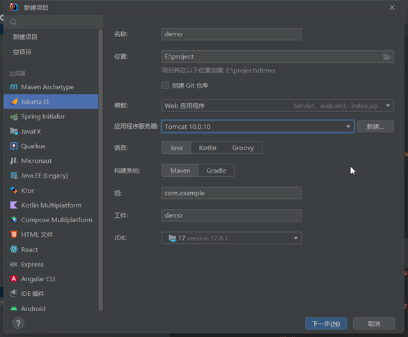

单击下一步，确认在规范目录下已经勾选好 Servlet，单击创建。


这是项目的基础目录结构。


删除 webapp 文件夹下的所有内容，然后把 rar 里所有文件丢到 webapp 下。

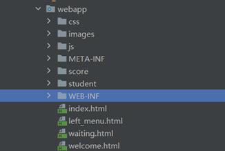

接下来处理 WEB-INF 文件夹的内容。删除`/src/main/java`文件夹下的内容，把 classes 文件夹里的.java 文件移到`/src/main/java`里面。（注意，没有特殊要求不要把 class 文件丢进去，你可以放进去之后手动删掉 class 文件）

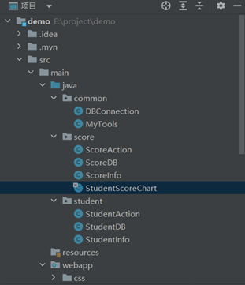

接下来右击项目名称，点击打开模块设置。当然，你也可以通过 文件 - 项目结构 - 项目设置 - 模块 找到接下来的操作界面。


点击“依赖”，选择“JAR 或目录…”，然后选中项目内 WEB-INF 文件夹里面的 lib 文件夹，添加后点击确定即可。


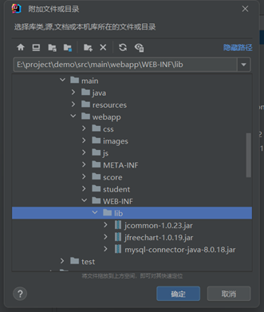
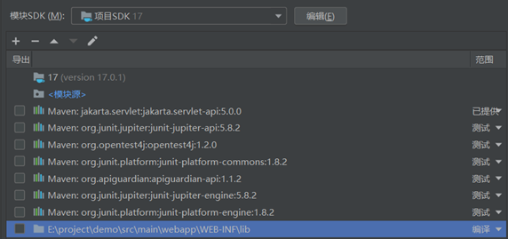

现在我们来配置运行 web 项目。右上角运行按钮旁边应该会出现一个 Tomcat 服务器的运行配置。


不管有没有，点开下拉栏，点击编辑配置。

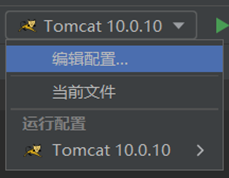

如果没有，就点击左上角“+”添加新配置，点击 Tomcat 服务器 - 本地。

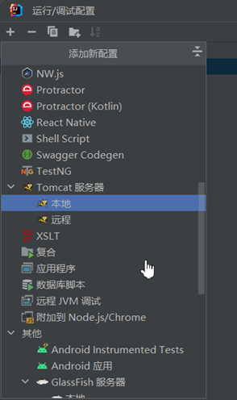

右侧栏目中，在“应用程序服务器”这一行点击配置，选择 Tomcat 解压的文件夹即可。

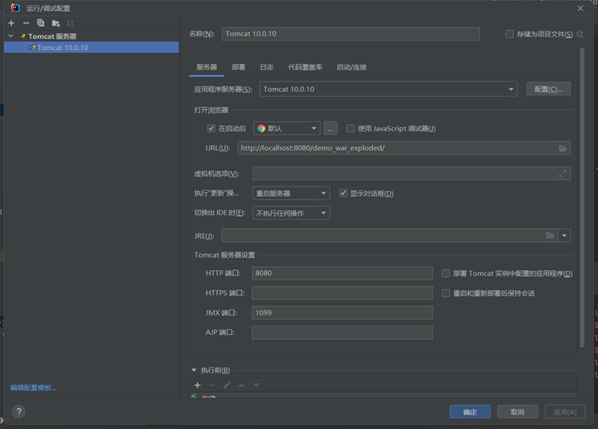

然后单击“部署”，在“在服务器启动时部署”栏中应该会出现一个已经配置好的工件。


如果没有，点击“+”然后选择工件即可。如果没有工件选项，需要去项目结构自行配置，这说明前面的流程你没有跟着我的教程走，idea 没有识别到你的 web.xml。


现在点击运行，网页应该就可以正常跑起来了。


## 如何导出包含源码的 War 包

由于我们创建的是 Maven 项目，而 Maven 已经为我们提供了轻松导出 war 包的指令，所以导出 war 包并非难事。创建项目后 IDEA 应该会自动帮我们配置 Maven，如果没有或者配置不了，可以参考这个视频：[教程](https://www.bilibili.com/video/BV16Q4y127BZ/)

在 Maven 项目中，pom.xml（Project Object Model）对于项目的配置起着主导控制作用，我们有空可以百度自学简单了解 Maven 项目中 pom.xml 的结构与功能。


我们打开项目的 pom.xml，重点看到 packaging 标签。这个标签管理 maven 项目的导出格式，有 jar、war、ear 和 pom 四种。大部分项目默认是 jar，这意味着项目会导出成 jar 包，我们把里面的值改成 war，像图中这样即可。


接下来我们打开 idea 的终端，或者在 cmd 中使用 cd 指令跳转到项目目录，输入指令：
    
```shell   
mvn clean package
```

（这条指令是 clean 和 package 的组合，clean 用于清除 target 生成的内容，package 用于生成内容）


等待片刻，接下来我们可以看到在项目根目录/target 文件夹下出现了打包好的 war 文件。

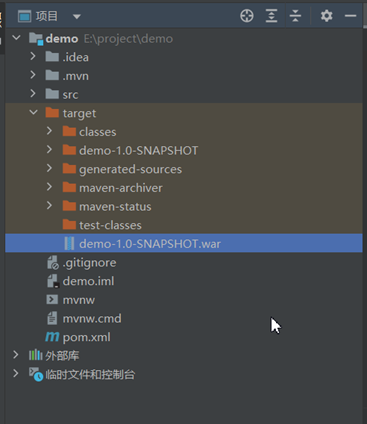

这个时候我们会发现，导出的 war 包里面不包含我们在`src/main/java`文件夹下的 java 文件，只包含生成好的 class 文件，这是为什么呢？

这是因为，默认情况下，maven 只把我们的 resources 文件夹和 webapp 文件夹当成了资源文件夹处理。我们继续处理 pom.xml。

在 pom 结尾会出现 build 标签。

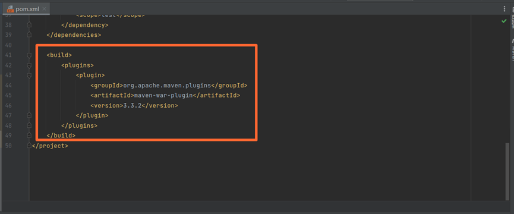

在`<build>`标签中加入如下内容：（包括 springboot 项目也可以这样做）

```xml
<resources>
    <resource>
        <directory>src/main/java</directory>
        <includes>
            <include>**/*.java</include>
            <!-- 你如果有其他后缀的文件也可以往里放，比如kotlin脚本 -->
            <!-- <include>**/*.kt</include> -->
        </includes>
    </resource>
</resources>
```

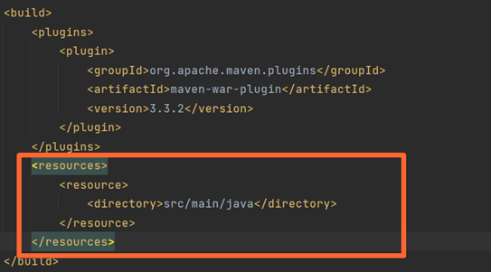

现在我们重新执行`mvn clean package`指令。执行完后我们会发现，在生成的 war 包的`/WEB_INF/classes`里面有我们需要的 java 代码了。（这里我拿我自己写的 spring 项目生成的文件演示）


这样我们就成功导出了包含源码的 war 包。