# IDEA如何连接数据库，执行SQL文件

作者：石皮幼鸟 [掘金](https://juejin.cn/user/3437526047270291) | [B站](https://space.bilibili.com/30915729)

## 前言

如果你的课表中恰好有一门课程名为“数据库应用技术”，那么你就来对地方了。

更巧的是，如果你是软工的学生，那么你的老师也会发一篇和本文一模一样的Word文档，其实那篇文档就是笔者写的这篇文章。

你是不是发现自己好像读过一模一样的话？没错，因为Web应用程序设计的那篇文章也是笔者写的。或许你在学校课程中遇到的很多旧技术新用教程，都是笔者在其中充当适配器角色而编写的。

同样，这篇文章也适合拥有逆反心理的你。

这门课将会教学一门名为Oracle的数据库，这个数据库极其怪异，在本地部署时可以选择非容器数据库部署，但是在服务器上部署时必须选择容器数据库部署。

但容器数据库情况下会遇到诸如连接失败、权限不足等问题，在服务器上不断折腾的你可能会因此破大防。

笔者在破大防之后还是硬生生吃下了这坨屎，解决了问题，所以在你放弃并部署到本地之前，还请耐心看完这篇文章。

当然，MySQL等数据库也是可以连接的，本地和服务器上的皆可。

只是笔者在这里以Oracle为例，IDEA可以连接MySQL、SQLServer、PostgreSQL、MongoDB、Redis等数据库，甚至连本地嵌入式数据库SQLite都可以连接。
（典中典之Realm没人权）

## 如何连接数据库

别用Navicat，要钱的，而且不好用，IDEA自带的数据库连接工具就够用了，当然前提是你的IDEA是专业版。

在IDEA右侧栏数据库按钮中连接数据库。

旧版UI：

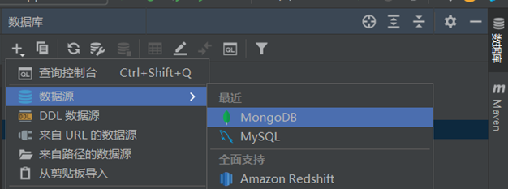

新版UI：

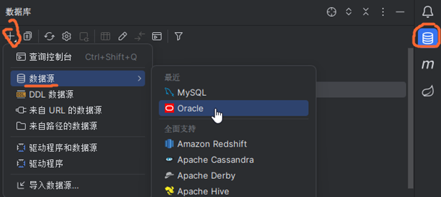

- 在弹出的窗口当中设置数据库信息，记得先设置成全局数据源，这样切换项目时也能继续使用这个数据库。
- 主机这一栏填写ip地址，如果是跑在本地上就写localhost。Oracle端口默认是1521。
- 如果使用的不是容器数据库，sid这里填写默认的sid就写，比如ORCL，反之，这里先不填。
- 驱动程序这里选择Thin就行，用户名密码也不多说了。
- 如果用的是容器数据库，在url这一栏，把图中我标注的冒号改成“/”，后面跟自己的pdb名称（这个时候你会发现sid那一栏也跟着变了）。
- 如何查询这里可以用的pdb，其实也不难，在SQLplus当中使用show pdbs;指令，查看本地的pdb情况，有read write权限的pdb就可以直接拿来用，反之需要你自己新建一个pdb。

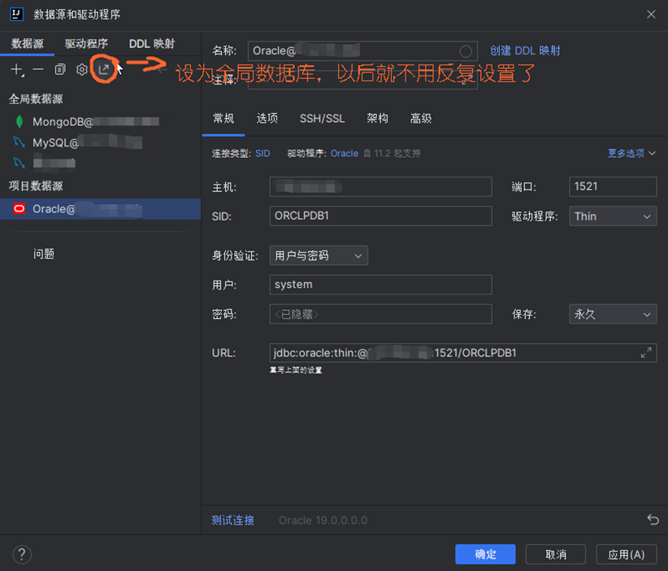

配置完成后，点击下载驱动按钮，下载成功后点击测试连接，如果一切正常，我们就可以进入下一步了。倘若下载速度较慢，可以尝试挂代理下载，因为资源服务器在国外。

如何辨别自己用的是不是容器数据库？在新建用户时，如果报出下面的错误，那你用的一定就是容器数据库。

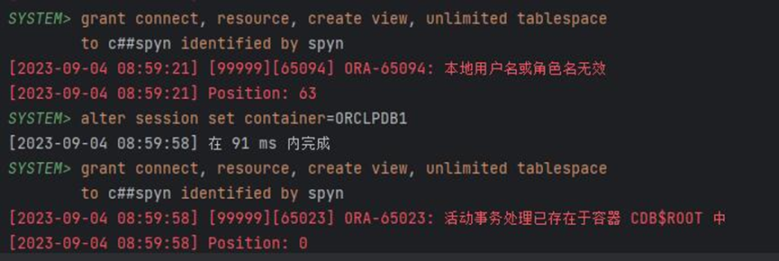

至于PDB是什么，CDB是什么，SQLplus是什么，如何新建pdb，那又是长篇大论，网上有教程，这里就不再细说了。有兴趣可以看看这篇文章：[教程](https://blog.csdn.net/weixin_47315082/article/details/131922971)

## 如何执行SQL文件

把sql文件随便拖进一个项目目录里面。

打开过后，应该会出现上面这一栏。

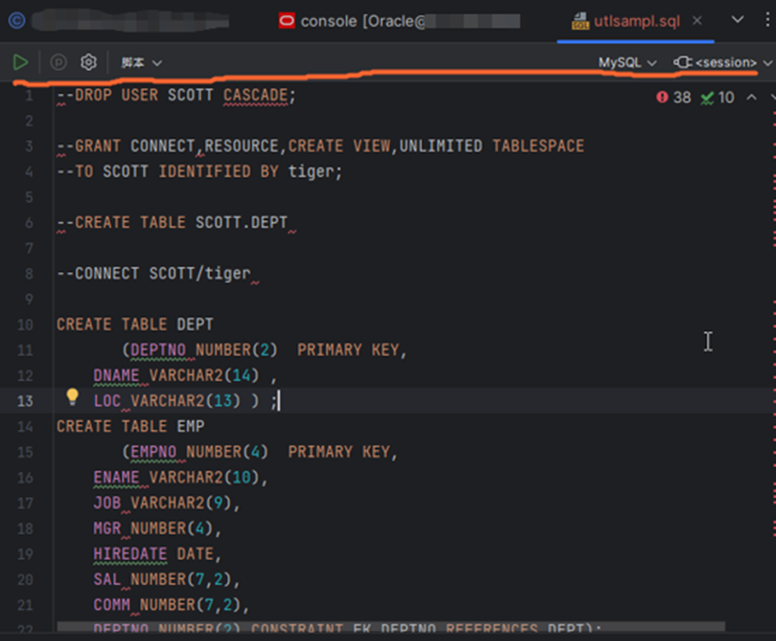

如果没有，就右击，在弹窗中选择附加会话，然后选中Oracle。

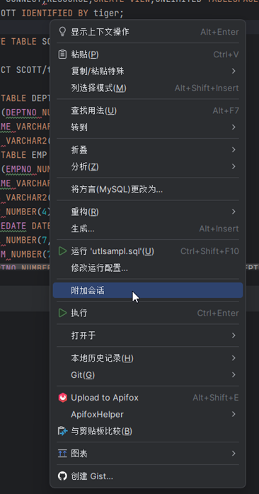

如果有，在右上角的MySQL那里切换成Oracle或者Oracle SQLplus，会话这边选择默认控制台或者新建一个都行。

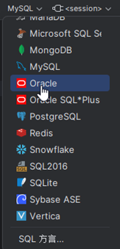

现在右击非注释或空行的语句就可以执行了，这里会出现两行选项，意思从上到下分别是提问你需要执行单条语句还是全文。这是IDEA提供的一个非常人性化的功能，在测试SQL语句是否正确的时候，单条执行非常快速方便。

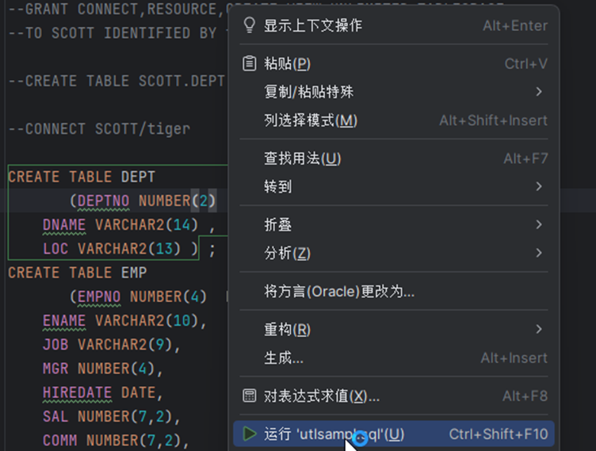
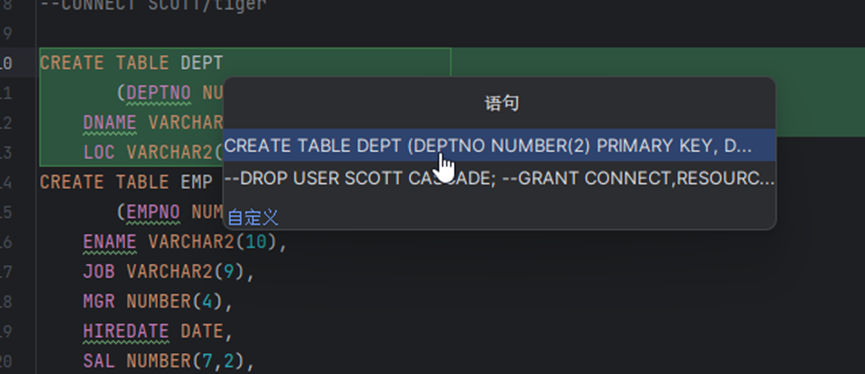

MySQL等其他类型数据库同理。此外，包括MongoDB这类以JavaScript为操作语言的非关系型数据库都可以通过这样的方式执行数据库脚本。

在IDEA的数据库工具侧栏点击这个按钮就可以打开默认控制台编写语句，非常方便。

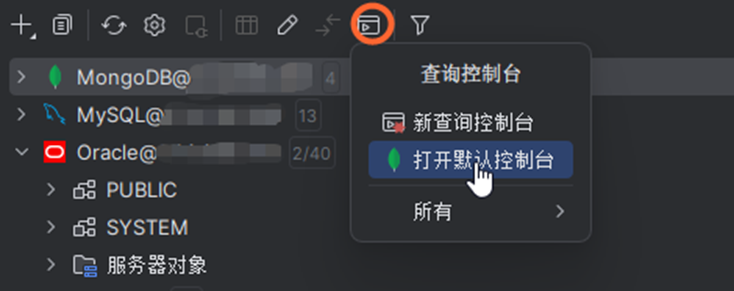
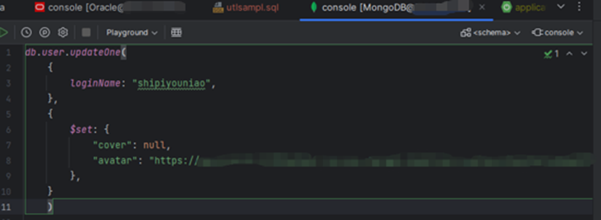

